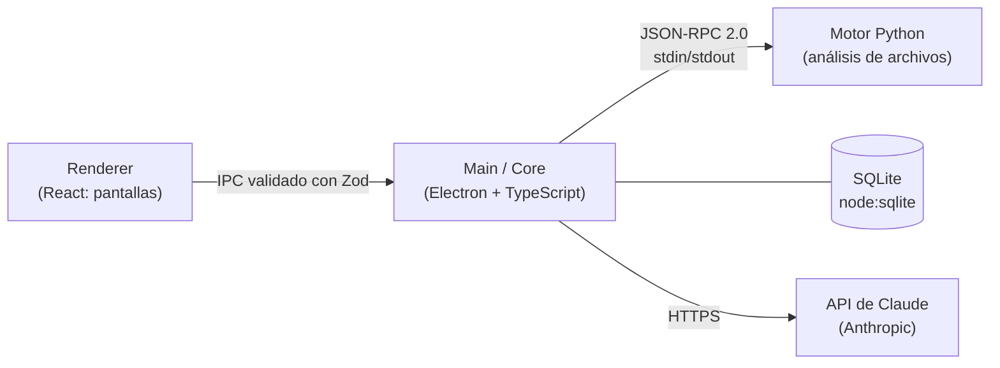

# CyberSOC Defender

[](https://github.com/YonierProgramas/CyberSOC/actions/workflows/ci.yml)

Antivirus de escritorio para Windows que analiza archivos **bajo demanda**, explica cada resultado con evidencias y usa la **API de Claude (Anthropic)** como asistente de análisis. La IA opina y explica, pero **nunca decide un veredicto ni ejecuta acciones**: eso lo hacen reglas deterministas y la persona usuaria.

> Proyecto académico. No reemplaza a un antivirus comercial: no tiene protección en tiempo real y sus firmas son de prueba.

---

## Contenido

1. [Qué hace](#qué-hace)
2. [Cómo funciona](#cómo-funciona)
3. [Requisitos](#requisitos)
4. [Instalación y arranque](#instalación-y-arranque)
5. [Primer uso](#primer-uso)
6. [Configurar la IA](#configurar-la-ia)
7. [Estructura del repositorio](#estructura-del-repositorio)
8. [Scripts disponibles](#scripts-disponibles)
9. [Pruebas y CI](#pruebas-y-ci)
10. [Seguridad y privacidad](#seguridad-y-privacidad)
11. [Añadir firmas y reglas](#añadir-firmas-y-reglas)
12. [Limitaciones conocidas](#limitaciones-conocidas)
13. [Solución de problemas](#solución-de-problemas)
14. [Documentación del proyecto](#documentación-del-proyecto)

---

## Qué hace

| Función                      | Descripción                                                                                                                                                      |
| ---------------------------- | ---------------------------------------------------------------------------------------------------------------------------------------------------------------- |
| **Escaneo bajo demanda**     | Analiza un archivo, una carpeta o una USB. Muestra progreso, permite cancelar y destaca en vivo los 10 resultados de mayor riesgo.                               |
| **Motor híbrido de 7 capas** | Hash SHA-256, firmas, tipo real del archivo, reglas YAML, heurísticas, análisis de ejecutables PE y de scripts.                                                  |
| **Zonas y perfiles**         | Clasifica cada ruta en una zona (Descargas, Temporales, Extraíble, Sistema, Programas…) y aplica las capas adecuadas a esa zona, o un perfil personalizado.      |
| **Evidencias y traza**       | Cada resultado muestra sus evidencias, qué capa corrió, cuál se omitió y por qué, y cómo se llegó al veredicto.                                                  |
| **Análisis con IA**          | Claude revisa las detecciones y explica su opinión citando las evidencias. La app muestra exactamente qué datos se enviaron.                                     |
| **SOC Copilot**              | Chat que responde sobre escaneos y resultados reales mediante herramientas de solo lectura, genera reportes y propone planes de escaneo que la persona confirma. |
| **Reportes**                 | Exportación a HTML, CSV y JSON con cifras calculadas desde la base de datos.                                                                                     |
| **Cuarentena**               | Aísla archivos cifrándolos (AES-256-GCM), con confirmación nativa de Windows. Permite restaurar, eliminar y confiar en un hash.                                  |
| **Historial**                | Consulta y filtra los escaneos y resultados anteriores.                                                                                                          |

## Cómo funciona

La aplicación está formada por tres partes que se comunican entre sí:



| Parte                        | Responsabilidad                                                                                                                                      | Lo que **no** hace                                                      |
| ---------------------------- | ---------------------------------------------------------------------------------------------------------------------------------------------------- | ----------------------------------------------------------------------- |
| **Renderer** (React)         | Pantallas, selección de archivos, confirmaciones. Solo usa la API limitada `window.cybersoc`.                                                        | No accede a Node, a la red ni a los archivos.                           |
| **Main / Core** (TypeScript) | Recorre carpetas, encola archivos, supervisa el motor, guarda en SQLite, aplica `RiskPolicy`, llama a Claude, gestiona la cuarentena y los secretos. | No deja que la IA decida veredictos.                                    |
| **Motor** (Python 3.12)      | Lee cada archivo, calcula hashes, detecta tipo, firmas, reglas, heurísticas, PE y scripts, y puntúa.                                                 | No usa la red, no accede a SQLite y nunca escribe archivos del usuario. |

**Flujo de un escaneo:** selección → clasificación por zona → recorrido de carpetas (DFS) → cola acotada → `scan.file` en el motor → `RiskPolicy` → transacción en SQLite → progreso en pantalla. La IA trabaja en una cola aparte, con prioridad por riesgo, reintentos y _circuit breaker_.

### Veredictos

| Veredicto      | Cuándo                                                                         |
| -------------- | ------------------------------------------------------------------------------ |
| `DETECTED`     | Coincide una firma o una regla decisiva.                                       |
| `SUSPICIOUS`   | Sin evidencia decisiva, pero con una puntuación de 30 o más.                   |
| `CLEAN`        | Puntuación menor de 30 o hash marcado como confiable por la persona usuaria.   |
| `NOT_ANALYZED` | No se pudo evaluar (error, archivo omitido o bloqueado). No equivale a limpio. |

Niveles de riesgo: BAJO (0–29), MEDIO (30–59), ALTO (60–84) y CRÍTICO (85–100).

**Reglas de `RiskPolicy`:** la IA puede escalar un resultado de `CLEAN` a `SUSPICIOUS` solo si su respuesta es válida, tiene confianza de 0,7 o más y cita evidencia local existente. Nunca crea `DETECTED` y nunca baja un veredicto.

## Requisitos

Entorno probado:

| Herramienta                      | Versión                                |
| -------------------------------- | -------------------------------------- |
| Windows                          | 10/11 x64                              |
| Node.js                          | 24 LTS (probado con 24.15.0) y npm 11  |
| Python                           | 3.12 (el motor exige `>=3.12,<3.13`)   |
| [uv](https://docs.astral.sh/uv/) | 0.11.x (gestiona el entorno de Python) |
| Git                              | cualquier versión reciente             |

No hace falta ejecutar la app como administrador. La instalación necesita Internet para descargar dependencias; el análisis local funciona sin conexión y sin clave de IA.

## Instalación y arranque

> Todavía **no hay instalador**: la app se ejecuta en modo desarrollo desde el código fuente.

En PowerShell:

```powershell
# 1. Clonar
git clone https://github.com/YonierProgramas/CyberSOC.git
cd CyberSOC

# 2. Motor Python
cd engine
uv sync --frozen
$env:PYTHONPATH = (Resolve-Path './src').Path   # necesario: el motor se lanza desde engine/src

# 3. Aplicación
cd ../app
npm ci

# 4. Arrancar
npm run dev
```

`npm run dev` compila la app y abre la ventana. `PYTHONPATH` debe estar definido **en la misma terminal** que ejecuta `npm run dev`. Si abres otra terminal, vuelve a definirlo antes de arrancar.

Para comprobar que todo está bien, abre **Estado**: debe decir `Motor: conectado v0.0.1 · protocolo 1`.

## Primer uso

1. **Escanear:** en **Escaneo**, deja el perfil _Automático por zona_ y pulsa **Escanear carpeta** o **Escanear archivo**.
2. **Revisar un resultado:** abre un resultado para ver el veredicto, las evidencias, las capas aplicadas y el análisis de IA.
3. **Cuarentena:** desde un resultado sospechoso o detectado, envía el archivo a cuarentena. Windows pide confirmación. En **Cuarentena** puedes restaurarlo o eliminarlo.
4. **SOC Copilot:** usa el panel de la derecha para preguntar, por ejemplo, _«¿Por qué fue marcado?»_ o _«Dame un reporte del último escaneo»_.

## Configurar la IA

La app usa **solo la API de Claude**, con el modelo `claude-haiku-4-5-20251001` para el análisis y el Copilot. Sin clave, todo lo demás sigue funcionando.

- **En la app:** ve a **Configuración → API de Claude**, pega tu API key, pulsa **Guardar** y luego **Probar conexión**. La clave se guarda cifrada con `safeStorage` de Electron (DPAPI de Windows) y la pantalla solo muestra sus últimos 4 caracteres.
- **En desarrollo (opcional):** la variable de entorno `CYBERSOC_ANTHROPIC_API_KEY`. **No uses `ANTHROPIC_API_KEY`**: la app la ignora a propósito.
- **Comprobar la conexión desde la terminal** (consume muy pocos tokens):

  ```powershell
  cd app
  $env:CYBERSOC_ANTHROPIC_API_KEY = "sk-ant-..."
  npm run ai:smoke
  ```

La cuenta de Anthropic necesita crédito disponible. Si no lo tiene, la API responde «credit balance is too low».

**Qué se envía a Claude:** metadatos, hashes, evidencias y capas del resultado. **Nunca se envía el contenido de los archivos.** En el análisis de un archivo, la carpeta personal se reemplaza por `%USERPROFILE%`. Las herramientas del Copilot sí pueden devolver rutas reales (ver [Limitaciones](#limitaciones-conocidas)).

## Estructura del repositorio

```text
CyberSOC/
├─ app/                      Aplicación Electron (TypeScript)
│  ├─ src/main/              Proceso principal: composición, IPC, diálogos, secretos
│  ├─ src/preload/           Puente seguro hacia el renderer
│  ├─ src/renderer/          Interfaz en React
│  ├─ src/shared/            Esquemas Zod compartidos (protocolo e IPC)
│  ├─ src/core/              Lógica sin dependencia de Electron
│  │  ├─ ai/                 Proveedor Claude, validación, worker, Copilot, herramientas
│  │  ├─ config/             Configuración de la app (esquema Zod y valores por defecto)
│  │  ├─ domain/             Modelo del escaneo (ciclo de vida de un trabajo)
│  │  ├─ engine/             Proceso del motor y cliente JSON-RPC
│  │  ├─ logging/            Logs estructurados en JSONL
│  │  ├─ persistence/        SQLite, migraciones y repositorios
│  │  ├─ quarantine/         Bóveda cifrada, restauración y allowlist
│  │  ├─ reports/            Construcción y exportación de reportes
│  │  ├─ risk/               RiskPolicy: decisión del veredicto final
│  │  ├─ scan/               Descubrimiento, colas y orquestador
│  │  ├─ structures/         Queue, Stack, PriorityQueue, PathTrie, TopK
│  │  └─ zones/              Clasificación de rutas por zona y perfiles de capas
│  ├─ scripts/               Smoke de IA, evaluación, benchmarks, capturador de evidencias
│  └─ tests/                 Pruebas unitarias, de integración y E2E (Vitest y Playwright)
├─ engine/                   Motor de análisis (Python 3.12)
│  ├─ src/cybersoc_engine/   Servidor JSON-RPC, capas, puntuación y modelos Pydantic
│  ├─ data/signatures/       Catálogo de firmas (de prueba)
│  ├─ data/rules/            Reglas YAML
│  └─ tests/                 Pruebas con pytest
├─ contracts/protocol-v1/    Mensajes de referencia del protocolo TS ↔ Python
└─ .github/workflows/ci.yml  CI en Windows: lint, tipos y pruebas de ambos lados
```

Regla de diseño: `app/src/core/` no importa Electron. ESLint lo hace cumplir.

## Scripts disponibles

Desde `app/`:

| Comando                                   | Para qué sirve                                                                         |
| ----------------------------------------- | -------------------------------------------------------------------------------------- |
| `npm run dev`                             | Compila y abre la app en modo desarrollo.                                              |
| `npm run build`                           | Compila a `out/`. **No genera un instalador.**                                         |
| `npm run typecheck`                       | Comprueba los tipos de TypeScript.                                                     |
| `npm run lint`                            | ESLint y Prettier.                                                                     |
| `npm test`                                | Pruebas unitarias y de integración (Vitest).                                           |
| `npm run test:e2e`                        | Pruebas de punta a punta con Electron y Playwright.                                    |
| `npm run ai:smoke`                        | Prueba real de conexión con la API de Claude.                                          |
| `npm run ai:eval -- --fake`               | Evaluación de escenarios de IA sin red. Sin `--fake` llama a la API y consume crédito. |
| `npm run perf:scan`                       | Medición de rendimiento del escaneo.                                                   |
| `npm run bench:queue`                     | Benchmark de la cola propia frente a `Array.shift`.                                    |
| `npm run calibrate`                       | Calibración del motor con un corpus benigno.                                           |
| `npm run evidence:capture -- --sprint 06` | Capturas automáticas de evidencias con datos temporales.                               |

Desde `engine/`: `uv run ruff check` (lint) y `uv run pytest` (pruebas).

## Pruebas y CI

```powershell
# Motor (desde engine/)
$env:PYTHONPATH = (Resolve-Path './src').Path
uv run ruff check
uv run pytest

# Aplicación (desde app/)
npm run typecheck
npm run lint
npm test
npm run test:e2e
```

Resultado en el commit `9432600` (cierre del Sprint 6):

| Suite                             | Resultado                                                           |
| --------------------------------- | ------------------------------------------------------------------- |
| pytest (motor)                    | 1467 pruebas pasan                                                  |
| Vitest (app)                      | 2235 pasan; 9 omitidas a propósito (`*.live`, llaman a Claude real) |
| E2E (Electron + Playwright)       | 6 de 6 pasan                                                        |
| ruff, typecheck, ESLint, Prettier | sin errores                                                         |

Las pruebas usan bases de datos temporales, archivos de prueba inofensivos y un proveedor de IA simulado (`FakeAIProvider`), así que **no consumen crédito**. Las pruebas `*.live` solo corren si se definen `CYBERSOC_RUN_AI_LIVE=1` y una clave.

El **CI de GitHub Actions** (`windows-latest`) se ejecuta en cada push a `main` y `Jhonier` y en cada pull request.

## Seguridad y privacidad

- **La IA nunca decide un veredicto** ni ejecuta acciones: solo `RiskPolicy` decide, y toda acción destructiva requiere la confirmación de la persona.
- **El motor Python** no usa la red, no accede a SQLite y nunca escribe archivos del usuario.
- **La ventana de Electron** está endurecida: `contextIsolation`, `sandbox` y CSP estricta, sin `nodeIntegration`, y navegación externa bloqueada.
- **La cuarentena** verifica que el archivo no haya cambiado desde el escaneo, cifra y verifica la copia antes de retirar el original, protege las rutas del sistema y nunca sobrescribe al restaurar.
- **Las respuestas de la IA** se validan con esquema, se comprueba que citen evidencias reales y se muestran como texto, nunca como HTML. Hay pruebas contra _prompt injection_.
- **Nunca** se guarda EICAR ni malware en el repositorio. Las firmas son marcadores de texto inofensivos (`CSD-TEST-*`) y la referencia a EICAR es solo su hash.
- **Nunca** se suben claves ni secretos al repositorio.

**Datos locales:** la base `cybersoc.db` y los logs se guardan en la carpeta de datos de la app (`userData`). La bóveda de cuarentena está en `%LOCALAPPDATA%\CyberSOC Defender\quarantine`. Para respaldarlas, cierra la app y copia la base y la bóveda juntas.

## Añadir firmas y reglas

- **Firmas:** edita `engine/data/signatures/test-signatures.json`. Cada firma tiene `id`, `title`, `sha256` y `testOnly`. Añade pruebas en `engine/tests/test_signatures.py` y reinicia la app para que el motor recargue el catálogo.
- **Reglas:** añade un archivo YAML en `engine/data/rules/`. El cargador rechaza campos extra y puntos que no correspondan a la severidad. Ejemplo:

  ```yaml
  id: R-TEST-DOWNLOADER
  name: Marcador de prueba de descargador
  description: Regla de prueba que busca un marcador inofensivo en scripts
  severity: HIGH
  points: 25
  decisive: false
  conditions:
    fileTypes: [SCRIPT_PS1, TEXT]
    maxScanBytes: 4194304
    strings:
      any: ['CYBERSOC_TEST_RULE_DOWNLOADER']
  ```

  Añade pruebas positivas y negativas en `engine/tests/test_rule_engine.py`.

## Limitaciones conocidas

- **Sin instalador:** solo funciona en modo desarrollo. Empaquetar el motor Python con la app (Python embebido + `electron-builder`) está pendiente.
- **Sin protección en tiempo real**, sin YARA, sin actualización remota de firmas y sin análisis de PDF.
- **Firmas y reglas de prueba:** no demuestran detección universal de malware ni ausencia de falsos positivos.
- **Privacidad del Copilot:** sus herramientas pueden devolver rutas reales y el chat envía lo que escribe la persona. No se envía el contenido de los archivos.
- **Planes de escaneo del Copilot:** al confirmar un plan se escanea solo su primera ruta.
- **Reportes:** los borradores caducan a los 15 minutos y no se recuperan al reabrir la app.

## Solución de problemas

| Síntoma                                                   | Causa probable y solución                                                                                                                                         |
| --------------------------------------------------------- | ----------------------------------------------------------------------------------------------------------------------------------------------------------------- |
| `Motor: desconectado` o `No module named cybersoc_engine` | Falta `PYTHONPATH`. Desde `engine/`, ejecuta `$env:PYTHONPATH = (Resolve-Path './src').Path` y vuelve a lanzar `npm run dev` en esa misma terminal.               |
| `npm run dev` termina sin abrir ninguna ventana           | La variable `ELECTRON_RUN_AS_NODE` está definida (ocurre en algunas terminales integradas). Ejecuta `Remove-Item Env:ELECTRON_RUN_AS_NODE` y vuelve a intentarlo. |
| El Copilot responde «La IA no está configurada»           | Pega la clave en **Configuración** y pulsa **Probar conexión**.                                                                                                   |
| `credit balance is too low`                               | La cuenta de Anthropic no tiene saldo: cárgalo en la consola de Anthropic.                                                                                        |
| `ERR_MODULE_NOT_FOUND` dentro de `node_modules`           | Instalación de dependencias dañada. Desde `app/`, ejecuta `npm ci`.                                                                                               |
| `uv sync` falla                                           | Comprueba que uv y Python 3.12 estén instalados (`uv --version`).                                                                                                 |

## Documentación del proyecto

Los planes de sprint, las decisiones de arquitectura (ADR), los manuales técnico y de usuario, las evidencias y los informes se mantienen en la carpeta `construccion/` del equipo, **fuera de este repositorio**. Este repositorio contiene solo código, configuración, pruebas y datos de prueba.

**Tecnologías:** Electron 44, React 19, TypeScript 5.9, Vite / electron-vite, Zod, `node:sqlite`, pino, Vitest, Playwright, Python 3.12, Pydantic, PyYAML, pefile, uv, `@anthropic-ai/sdk`.
